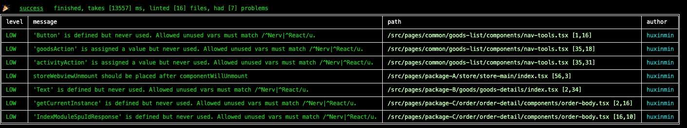

# reviewEditAuto

scan your project, only review changed code in given time-range automatic

# Requirement

require nodejs version>= 12.2.0

# Mechanism

1. list your edited files in given time-range
2. scan these files and auto review
3. extract only changed lines
4. generate report

# Usage

```sh
npm install -g review-edit-auto
cd yourProject
# default review in 1 week
review code
# you can specify time
review code --since 2022-03-02
# or
review code --since 2.weeks
```

you can skip some level by using `--filterLv low`, then this level logs will never show in your report.

```sh
review code --filterLv low
```

if you want to use your own `eslintrc` file instead of default provided, you can:

```sh
# will find your eslint config files in your project root dir
review code --useOutRc
```


